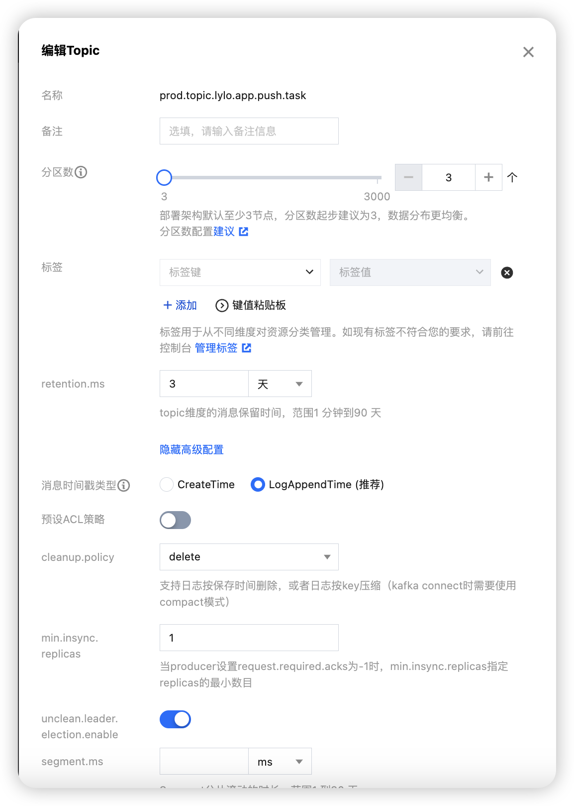
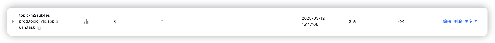

# kafka在什么情况下可以保证消息不丢失？
“Kafka 只对“已提交”的消息（committed message）做有限度的持久化保证。”
## 已提交的消息
Broker 成功地接收到一条消息并写入到日志文件后，告诉生产者程序这条消息已成功提交。
## 有限度的持久化保证
假如你的消息保存在 N 个 Kafka Broker 上，那么这个前提条件就是这 N 个 Broker 中至少有 1 个存活。

# 消息丢失案例
## 生产者丢失消息
- 原因：生产者在将消息发送到 Broker 时，可能会因为网络问题导致消息丢失。
- 解法：“Producer 永远要使用带有回调通知的发送 API，也就是说不要使用 producer.send(msg)，而要使用 producer.send(msg, callback)”
- lylo实际案例：
  - go sdk:confluent-kafka-go中已经默认实现了回调通知：func (p *Producer) produce(msg *Message, msgFlags int, deliveryChan chan Event) error
    - deliveryChan chan Event : 消息投递回调通道
      - 如果指定了这个通道，消息的投递状态会发送到这个通道
      - 如果为 nil，则发送到 Producer 的全局 Events 通道
  ```go
  deliveryChan := make(chan kafka.Event)
	defer func() {
		close(deliveryChan)
	}()
	if err = p.producer.Produce(msg, deliveryChan); err != nil {
		logger.Builder().Field("err", err).Error(ctx)
		return
	}
	e := <-deliveryChan
	switch ev := e.(type) {
	case *kafka.Message:
		if ev.TopicPartition.Error != nil {
			err = fmt.Errorf("producer closed")
		}
	}
  confMap := kafka.ConfigMap{
		"bootstrap.servers":             address,
		"security.protocol":             "plaintext",
		"acks":                          acks,
		"api.version.request":           "true",
		"message.max.bytes":             1000000,
		"linger.ms":                     500,
		"sticky.partitioning.linger.ms": 1000,
		"retries":                       math.MaxInt32,
		"retry.backoff.ms":              1000,
	}
  ```
  - 优化建议：增加超时时间
  
  
## 消费者丢失消息
- 原因：先更新位移，后消费消息
- 解法：先消费消息，后更新位移
  - 引入重复消费问题
  - 需要关闭自动提交，使用手动提交
    - 自动提交：Kafka 消费者默认每隔 auto.commit.interval.ms（默认 5 秒）自动提交一次 offset（位移），提交的是 当前已拉取但尚未完成处理的消息的最大 offset

# 无消息丢失的配置最佳实践
## Producer 配置
1. 不要使用 producer.send(msg)，而要使用带回调结果的 api： producer.send(msg, callback)。
2. 设置 acks = all。表明所有副本 Broker 都要接收到消息，该消息才算是“已提交”。这是最高等级的“已提交”定义。
3. 设置 retries 为一个较大的值。当出现网络的瞬时抖动时 Producer 能够自动重试消息发送。
## Broker 配置
1. 设置 unclean.leader.election.enable = false（禁止从非同步副本（Out-of-Sync Replicas, OSR）选举 Leader，只允许从 ISR（In-Sync Replicas） 中选举）。它控制的是哪些 Broker 有资格竞选分区的 Leader。如果一个 Broker 落后原先的 Leader 太多，那么它一旦成为新的 Leader，必然会造成消息的丢失。
2. 设置 replication.factor >= 3。控制 每个分区（Partition）的副本数量
3. 设置 min.insync.replicas > 1。控制的是消息至少要被写入到多少个副本才算是“已提交”。设置成大于 1 可以提升消息持久性。在实际环境中千万不要使用默认值 1。
4. 确保 replication.factor > min.insync.replicas。如果两者相等，那么只要有一个副本挂机，整个分区就无法正常工作了。推荐设置成 replication.factor = min.insync.replicas + 1。


## Consumer 配置
1. 设置 enable.auto.commit = false，关闭自动提交 offset。

# 极端情况
动态扩容分区时，“Producer 先于 Consumer 感知到新增加的分区，而 Consumer 设置的是“从最新位移处”开始读取消息（auto.offset.reset=latest）”
```text
T0: Admin 增加分区到 N+M
T1: Producer 刷新元数据（感知到新分区 N+1...N+M）
T2: Producer 开始向新分区写入消息（此时 Consumer 未感知新分区）
T3: Consumer 延迟数分钟后刷新元数据（感知新分区）
T4: Consumer 从新分区的 latest offset 开始消费 → 漏读 T2-T3 期间的消息
```
解法：
- 增加分区前，先停止所有生产者
- 使用外部存储记录扩容事件（可靠型）
  - 创建辅助主题 partition-change-events 记录分区变更事件。
  - 生产者写入新分区前，先向该主题写入一条扩容事件消息。
  - 消费者同时订阅主主题和辅助主题，发现扩容事件后主动重置偏移量
备注：
auto.offset.reset：
 - earliest	从分区的最早可用消息开始消费（即第一条消息，Offset=0）。	需要重新处理全部历史数据（如数据回溯）。
 - latest	从分区的最新消息开始消费（即只消费消费者启动后新产生的消息）。	仅关注实时数据，忽略历史消息。
 - none	如果找不到先前的 Offset，则抛出异常（NoOffsetForPartitionException）。	严格要求 Offset 存在，避免意外消费。


动态扩容分区时，消息丢失情况如何优雅处理？
动态扩容分区有哪些缺点，如何解决？