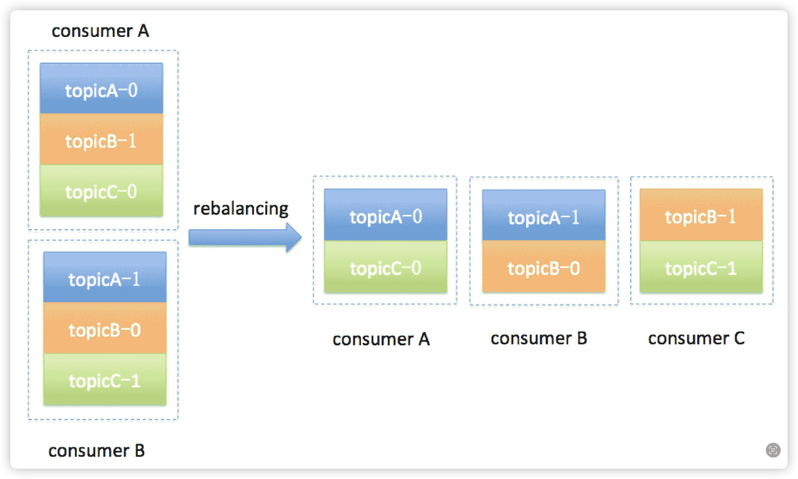

# 基础
 - Consumer Group 下可以有一个或多个 Consumer 实例。这里的实例可以是一个单独的进程，也可以是同一进程下的线程。
 - Group ID 是一个字符串，在一个 Kafka 集群中，它标识唯一的一个 Consumer Group。
 - Consumer Group 下所有实例订阅的主题的单个分区，只能分配给组内的某个 Consumer 实例消费。这个分区当然也可以被其他的 Group 消费。

## 有哪些消息发送模型
 - 点对点模型：一个生产者对应一个消费者
 - 发布订阅模型：一个生产者对应多个消费者

## Consumer Group如何实现两种消息模型
 - 点对点：一个主题对应一个消费者组
 - 发布订阅：一个主题对应多个消费者组

## 一个Consumer Group下应该有多少个Consumer实例
 - 理想情况下，Consumer 实例的数量应该等于该 Group 订阅主题的分区总数。
  
### 举例：“假设一个 Consumer Group 订阅了 3 个主题，分别是 A、B、C，它们的分区数依次是 1、2、3”
 - 理想情况下，该 Group 下应该有 6 个 Consumer 实例。
 - 如果设置 3 个实例，那么平均下来每个实例大约消费 2 个分区（6 / 3 = 2）
 - 如果设置 8 个实例，有 2 个实例（8 – 6 = 2）将不会被分配任何分区，它们永远处于空闲状态。

## Rebalance重平衡是什么意思？
 - 本质上是一种协议，规定了一个 Consumer Group 下的所有 **Consumer实例** 如何达成一致，来分配订阅 Topic 的每个**分区**

## Consumer Group 何时进行 Rebalance？
 - Consumer 实例数发生变化：新增、离开（包括崩溃踢出）
 - 订阅的 Topic 数量发生变化：Consumer Group通过正则方式订阅 Topic
 - 订阅的 Topic 的分区数增加时（分区只允许增加）

## Rebalance会引起哪些问题？
 - 应用程序需要处理 Rebalance 带来的消息重复消费问题
 - stop the world，所有 Consumer 实例都会停止消费，等待 Rebalance 完成
 - 全部重新分配所有分区，无法复用Broker 的 TCP 连接，更高效的方式是重新分配时参考之前分配的结果，尽量减少分配方案的变动
 - Rebalance 很慢，曾经存在案例： Group 内有几百个 Consumer 实例，成功 Rebalance 一次要几个小时