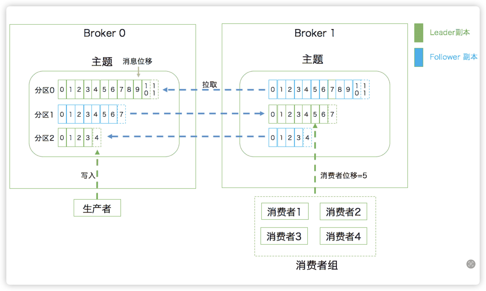

# 三层架构
- 主题层：每个主题可以有多个分区
- 分区层：每个分区可以有多个副本，每个副本可以有一个leader和多个follower，客户端只和leader通信
- 消息层：分区中包含多条消息，每个消息有一个偏移量（从 0 开始）

# 持久化方式
- 消息被追加到分区日志中，分区日志以分段的形式存储在文件系统中
- 消息被追加到页缓存中，然后批量地写入文件系统
- 消息被写入一个特定的文件中，然后批量地写入文件系统

# 日志方式的优势
- 顺序读写

# 重平衡